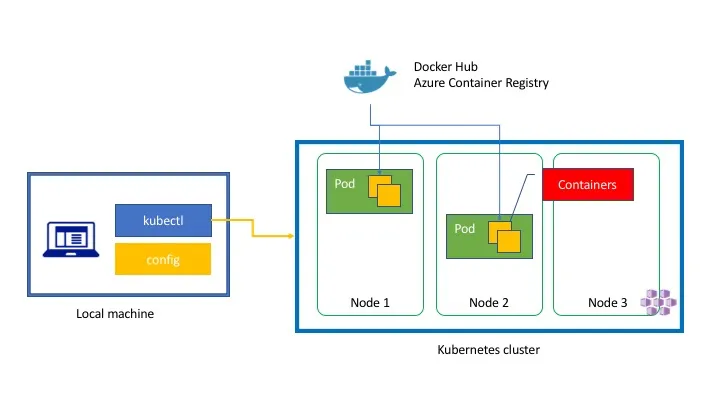
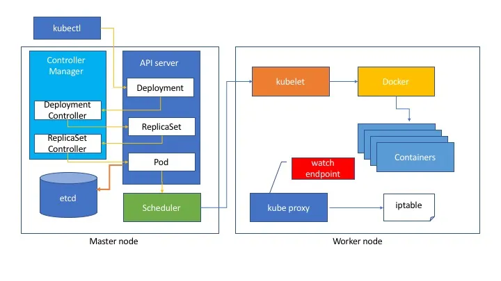

Tôi đã hỗ trợ một sự kiện Open Hack về container. Một trong những người tham dự đã nhờ tôi vẽ một sơ đồ để hiểu tổng quan về Kubernetes. Khi bạn bắt đầu với Kubernetes, bạn có thể bị choáng ngợp bởi rất nhiều thuật ngữ. Với những ai cần giải thích khái niệm này, có thể cần một thứ gì đó để minh họa tổng quan. Tôi đã tạo ba sơ đồ để giúp hiểu tổng quan cơ bản về các thuật ngữ của Kubernetes.

Hy vọng điều này sẽ hữu ích.

### Triển khai Container



Kubernetes cho phép bạn sử dụng cụm như thể nó là một máy tính cá nhân duy nhất. Bạn không cần quan tâm đến chi tiết hạ tầng bên dưới. Chỉ cần khai báo những gì bạn muốn trong file yaml, bạn sẽ nhận được đúng thứ mình cần.

Khi sử dụng Kubernetes, bạn có thể dùng lệnh kubectl để điều khiển cụm Kubernetes. Nó hoạt động với file cấu hình. Nếu dùng Azure, bạn có thể lấy file cấu hình bằng lệnh [az aks get-credentials](https://docs.microsoft.com/en-us/cli/azure/aks?view=azure-cli-latest#az_aks_get_credentials "‌"). Khi thực thi lệnh này, nó sẽ gửi yêu cầu tới cụm Kubernetes qua Rest API, tạo [một Pod](https://kubernetes.io/docs/concepts/workloads/pods/pod/#what-is-a-pod "‌"). Một pod có thể chứa một hoặc nhiều container bên trong. Kubernetes sẽ tải image từ [DockerHub](https://hub.docker.com/ "‌") hoặc [Azure Container Registry](https://azure.microsoft.com/nl-nl/services/container-registry/ "‌"). Cụm Kubernetes có nhiều node. Tuy nhiên, Kubernetes sẽ phân bổ pod lên một node nào đó. Bạn không cần biết pod nằm trên node nào, Kubernetes sẽ lo việc đó cho bạn.

```console
$ kubectl get pods
NAME                        READY     STATUS    RESTARTS   AGE
minecraft-927348482-rznvq   1/1       Running   0          2d
$ kubectl get nodes
NAME                    STATUS    ROLES     AGE       VERSION
k8s-agent-ac084391-0    Ready     agent     3d        v1.7.7
k8s-agent-ac084391-1    Ready     agent     3d        v1.7.7
k8s-master-ac084391-0   Ready     master    3d        v1.7.7
```

### Đối tượng Kubernetes

Nếu bạn muốn điều phối container trong Kubernetes, bạn có thể dùng file yaml như sau.

```yaml
apiVersion: apps/v1beta1
kind: Deployment
metadata:
  name: azure-vote-back
spec:
  replicas: 1
  template:
    metadata:
      labels:
        app: azure-vote-back
    spec:
      containers:
        - name: azure-vote-back
          image: redis
          ports:
            - containerPort: 6379
              name: redis
---
apiVersion: v1
kind: Service
metadata:
  name: azure-vote-back
spec:
  ports:
    - port: 6379
  selector:
    app: azure-vote-back
---
apiVersion: apps/v1beta1
kind: Deployment
metadata:
  name: azure-vote-front
spec:
  replicas: 1
  template:
    metadata:
      labels:
        app: azure-vote-front
    spec:
      containers:
        - name: azure-vote-front
          image: microsoft/azure-vote-front:v1
          ports:
            - containerPort: 80
          env:
            - name: REDIS
              value: "azure-vote-back"
---
apiVersion: v1
kind: Service
metadata:
  name: azure-vote-front
spec:
  type: LoadBalancer
  ports:
    - port: 80
  selector:
    app: azure-vote-front
```

Sau khi tạo file yaml, bạn có thể tạo các resource trên kubernetes như sau. Để biết chi tiết hơn, hãy xem [hướng dẫn này](https://docs.microsoft.com/en-us/azure/aks/kubernetes-walkthrough "‌").

```console
kubectl create -f azure-vote.yaml
```

Tuy nhiên, file yaml này chứa rất nhiều từ như Service, Deployment, ReplicaSet, v.v. Tôi sẽ giải thích bằng sơ đồ. Các đối tượng này là sự trừu tượng hóa tài nguyên vật lý.


#### Pod

[Một _pod_](https://kubernetes.io/docs/concepts/workloads/pods/pod/ "‌") (giống như một bầy cá voi hoặc một quả đậu) là một nhóm một hoặc nhiều container (ví dụ container Docker), chia sẻ lưu trữ/mạng, và có mô tả về cách chạy các container đó.

#### Replica Set

[Một _Replica Set_](https://kubernetes.io/docs/concepts/workloads/controllers/replicaset/ "‌") đảm bảo rằng một số lượng pod nhất định luôn chạy tại mọi thời điểm. Nói cách khác, Replica Set đảm bảo rằng một pod hoặc một nhóm pod đồng nhất luôn sẵn sàng. Replica Set giúp bạn định nghĩa số lượng pod cần có. Nếu bạn đặt replica là ba, khi một pod chết, Replica Set sẽ tạo pod mới để luôn đủ ba pod.

#### Deployment

[Một _Deployment_](https://kubernetes.io/docs/concepts/workloads/controllers/deployment/ "‌") cung cấp cập nhật khai báo cho [Pods](https://kubernetes.io/docs/concepts/workloads/pods/pod/ "‌") và [ReplicaSets](https://kubernetes.io/docs/concepts/workloads/controllers/replicaset/ "‌"). Bạn mô tả _trạng thái mong muốn_ trong một đối tượng Deployment, và controller Deployment sẽ thay đổi trạng thái thực tế thành trạng thái mong muốn một cách có kiểm soát. Bạn có thể định nghĩa Deployment để tạo ReplicaSet mới, hoặc xóa Deployment cũ và chuyển toàn bộ resource sang Deployment mới. Một Deployment bao gồm Pod(s) và Replica Set. Nó cũng giúp cập nhật resource khi bạn triển khai phiên bản mới.

#### Service

Một `Service` trong Kubernetes là một lớp trừu tượng định nghĩa một tập hợp logic các `Pod` và chính sách truy cập chúng - đôi khi gọi là micro-service. Nếu bạn tạo một pod, bạn không biết nó ở đâu. Ngoài ra, pod có thể bị xóa bởi ai đó hoặc do node gặp sự cố. Service cung cấp một endpoint cho các pod của bạn. Nếu bạn chỉ định “type=LoadBalancer” nó sẽ thực sự tạo một Azure Load Balancer để xuất pod ra ngoài với địa chỉ IP công cộng.

#### Storage Class

[Một ](https://kubernetes.io/docs/concepts/storage/storage-classes/ "‌")`StorageClass` cung cấp cách để quản trị viên mô tả các “lớp” lưu trữ mà họ cung cấp. Nó đại diện cho một Persistent Volume như Azure Disk, Azure File hoặc các loại lưu trữ khác.

#### Persistent Volume Claim

Persistent Volume Claim là sự trừu tượng hóa của Persistent Volume. Persistent Volume là tài nguyên vật lý của hạ tầng. Kubernetes muốn ẩn chi tiết này khỏi lập trình viên. Sử dụng Persistent Volume Claim, bạn có thể ẩn khai báo vật lý được định nghĩa bởi Persistent Volume hoặc Storage Class. Pod có thể mount Volume thông qua Persistent Volume Claim.

### Kiến trúc

Bạn đã học về các lớp trừu tượng. Tuy nhiên, bạn cũng nên biết về kiến trúc.



Kubernetes có nhiều node Master và node Worker. Các container của bạn chạy trên các node Worker. Các node Worker có thể mở rộng. Khi bạn triển khai resource Kubernetes bằng file Yaml với lệnh kubectl, nó sẽ gửi yêu cầu POST tới API server. API server lưu dữ liệu vào [etcd](https://github.com/coreos/etcd "‌"), là kho key-value phân tán. Các thành phần khác như Controller Manager, Scheduler sẽ quan sát sự thay đổi trạng thái của API server. Khi bạn tạo file `some.yaml` với một deployment rồi `kubectl create -f some.yaml`, nó gửi dữ liệu yaml tới API Server. API Server tạo một đối tượng Deployment. Controller Deployment phát hiện sự thay đổi, tạo đối tượng ReplicaSet trên API Server. Controller ReplicaSet phát hiện thay đổi, dựa vào số replica sẽ tạo các đối tượng Pod. Scheduler, chịu trách nhiệm phân bổ tài nguyên pod, sẽ ra lệnh cho kubelet (chạy trên mọi node worker) thực thi lệnh docker và tạo container. Mỗi node worker đều có kube proxy để điều khiển định tuyến. Ví dụ, nếu bạn tạo một đối tượng service trên API Server, Endpoint Controller sẽ tạo một đối tượng Endpoint trên API Server. Kube Proxy quan sát trạng thái Endpoint trên API server, sau đó cấu hình iptable để định tuyến endpoint tới container.

### Kết luận

Bây giờ bạn có thể không còn sợ sơ đồ này nữa. :) Hy vọng các sơ đồ này sẽ giúp ích cho bạn.


[https://docs.microsoft.com/en-us/azure/container-service/kubernetes/container-service-intro-kubernetes](https://docs.microsoft.com/en-us/azure/container-service/kubernetes/container-service-intro-kubernetes "‌")

### Tài liệu tham khảo

- [Kubernetes in three diagrams](https://tsuyoshiushio.medium.com/kubernetes-in-three-diagrams-6aba8432541c)
- [Kubernetes in Action](https://www.manning.com/books/kubernetes-in-action "‌")
- [Tutorial (Triển khai Azure Container Service (AKS) cluster)](https://docs.microsoft.com/en-us/azure/aks/kubernetes-walkthrough "‌")
- [kubernetes.io](https://kubernetes.io/ "‌")
