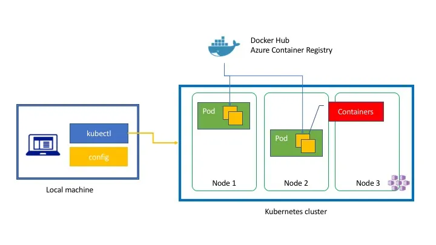
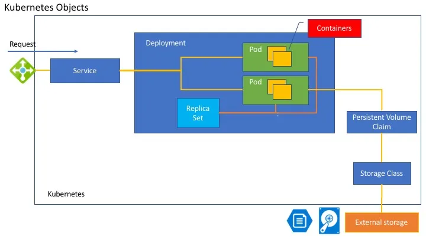
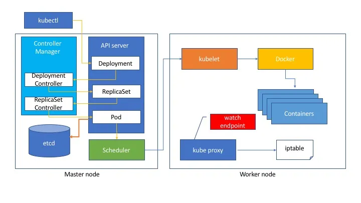
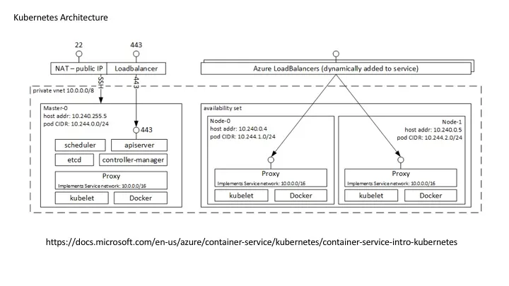

I helped an Open Hack event for container. One of the attendees ask me to draw a diagram to understand the overview of the kubernetes. When you start the Kubernetes, you might be overwhelmed to encounter a lot of terminologies. For someone who explains the concept might need something to explain the overview. I create three diagram to understand the fundamental overview of the terminologies of Kubernetes.

I hope this helps.

### Container Deployment



Kubernetes enable you to use the cluster as if it is single PC. You don’t need to care the detail of the infrastructure. Just declare the what you want in yaml file, you will get what you want.

When you use Kubernetes, you can use kubectl command to control the kubernetes cluster. It works with config file. If it is Azure, you can get it by [az aks get-credentials](https://docs.microsoft.com/en-us/cli/azure/aks?view=azure-cli-latest#az_aks_get_credentials) command. Once you execute the command, it send request to the kubernetes cluster via Rest API, it create [a Pod](https://kubernetes.io/docs/concepts/workloads/pods/pod/#what-is-a-pod). A pod can include one or several containers inside it. Kubernetes download the image from [DockerHub](https://hub.docker.com/) or [Azure Container Registry](https://azure.microsoft.com/nl-nl/services/container-registry/). The kubernetes cluster has several nodes. However, Kubernetes allocate the pod in some node. Then you need to know which pod is on which node. Kubernetes looks after it for you.

```shell
$ kubectl get pods
NAME                        READY     STATUS    RESTARTS   AGE
minecraft-927348482-rznvq   1/1       Running   0          2d
$ kubectl get nodes
NAME                    STATUS    ROLES     AGE       VERSION
k8s-agent-ac084391-0    Ready     agent     3d        v1.7.7
k8s-agent-ac084391-1    Ready     agent     3d        v1.7.7
k8s-master-ac084391-0   Ready     master    3d        v1.7.7
```

### Kubernetes Objects

If you want to orchestrate the container in Kubernetes, you can use yaml file. like this.

```yaml
apiVersion: apps/v1beta1
kind: Deployment
metadata:
  name: azure-vote-back
spec:
  replicas: 1
  template:
    metadata:
      labels:
        app: azure-vote-back
    spec:
      containers:
      - name: azure-vote-back
        image: redis
        ports:
        - containerPort: 6379
          name: redis
---
apiVersion: v1
kind: Service
metadata:
  name: azure-vote-back
spec:
  ports:
  - port: 6379
  selector:
    app: azure-vote-back
---
apiVersion: apps/v1beta1
kind: Deployment
metadata:
  name: azure-vote-front
spec:
  replicas: 1
  template:
    metadata:
      labels:
        app: azure-vote-front
    spec:
      containers:
      - name: azure-vote-front
        image: microsoft/azure-vote-front:v1
        ports:
        - containerPort: 80
        env:
        - name: REDIS
          value: "azure-vote-back"
---
apiVersion: v1
kind: Service
metadata:
  name: azure-vote-front
spec:
  type: LoadBalancer
  ports:
  - port: 80
  selector:
    app: azure-vote-front
```

Once create a yaml file, you can create the resources on kubernetes. like this. for more detail. Please refer [this tutorial](https://docs.microsoft.com/en-us/azure/aks/kubernetes-walkthrough).

```shell
kubectl create -f azure-vote.yaml
```

However, this yaml file include a lot of words like Service, Deployment, ReplicaSet or something like that. I’ll explain using a diagram. These objects are abstraction of the physical resources.



#### Pod

[A _pod_](https://kubernetes.io/docs/concepts/workloads/pods/pod/) (as in a pod of whales or pea pod) is a group of one or more containers (such as Docker containers), with shared storage/network, and a specification for how to run the containers.

#### Replica Set

[A _Replica Set_](https://kubernetes.io/docs/concepts/workloads/controllers/replicaset/) ensures that a specified number of pod replicas are running at any one time. In other words, a Replica Set makes sure that a pod or a homogeneous set of pods is always up and available. A Replica set help you to define how many pods are available. If you define replica as three, then one pod die, the Replica Set create a pod to make it three.

#### Deployment

[A _Deployment_](https://kubernetes.io/docs/concepts/workloads/controllers/deployment/) controller provides declarative updates for [Pods](https://kubernetes.io/docs/concepts/workloads/pods/pod/) and [ReplicaSets](https://kubernetes.io/docs/concepts/workloads/controllers/replicaset/).You describe a _desired state_ in a Deployment object, and the Deployment controller changes the actual state to the desired state at a controlled rate. You can define Deployments to create new ReplicaSets, or to remove existing Deployments and adopt all their resources with new Deployments. A Deployment include Pod(s) and Replica Set. It also help to update the resources when you deploy new version.

#### Service

A Kubernetes `Service` is an abstraction which defines a logical set of `Pods` and a policy by which to access them - sometimes called a micro-service. If you create a pod, you don’t know where it is. Also, a pod might be killed by someone or some shortage of a node. Service provide an endpoint of the pods for you. If you specify “type=LoadBalancer” it actually create an Azure Load Balancer to expose pod with Public IP address.

#### Storage Class

[A `StorageClass`](https://kubernetes.io/docs/concepts/storage/storage-classes/) provides a way for administrators to describe the “classes” of storage they offer. It represent a Persistent Volume like Azure Disk or Azure File or some other storage.

#### Persistent Volume Claim

Persistent Volume Claim is the abstraction of the Persistent Volume. Persistent Volume is physical resources of infrastructure. Kubernetes want to hide the detail from developers. Using Persistent Volume Claim, you can hide the physical declaration defined by Persistent Volume or Storage Class. Pod can mount the Volume using Persistent Volume Claim object.

### Architecture

You learned the abstraction. However, you might know the architecture.



Kubernetes has several Master nodes and Worker nodes. Your containers work on Worker nodes. Worker nodes scales.
Once you deploy kubernetes resources using Yaml file with kubectl command, it send Post request to the API server. The API server store the data into [ectd](https://github.com/coreos/etcd), which is the distributed key value store. Other resources like Controller Manager, Scheduler, observe the change state of the API server. When you create a `some.yaml` file with a deployment then `kubectl create -f some.yaml` It send the yaml data to the API Server. It create a Deployment object on the API Server. Deployment controller detect the change of the deployment, it create ReplicaSet object on the API Server. The Replica Set Controller detect the change then according to the number of replica, create Pod objects. The Scheduler, that is in charge of the pod resource allocation, commands the kubelet, which reside on every worker nodes, execute docker command and create containers. Every worker nodes have a kube proxy to control the routing. For example, If you create a service object on the API Server, Endpoint Controller create an Endpoint object on the API Server. Kube Proxy watch the API server Endpoint state, then configure iptables to route the endpoint to the container.

### Conclusion

Now you might not afraid this diagram. :) I hope these diagrams helps.



[https://docs.microsoft.com/en-us/azure/container-service/kubernetes/container-service-intro-kubernetes](https://docs.microsoft.com/en-us/azure/container-service/kubernetes/container-service-intro-kubernetes)

### Resource

- [Kubernetes in Action](https://www.manning.com/books/kubernetes-in-action)
- [Tutorial (Deploy Azure Container Service (AKS) cluster)](https://docs.microsoft.com/en-us/azure/aks/kubernetes-walkthrough)
- [kubenetes.io](https://kubernetes.io/)
